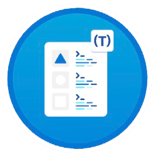

# My TypeScript Journey: Earned Badges

## Badges Overview

<h2 style="display:inline-block;margin-top:36px;border:none;margin-left:24px">Build JavaScript applications using TypeScript</h2>

<a target="_blank" style="color:steelblue;margin-left:8px" href="https://learn.microsoft.com/en-us/users/nginit-1361/achievements/9xs22yqu">Open badge</a> 

 

<h2 style="display:inline-block;margin-top:36px;border:none;margin-left:24px">Getting Started with TypeScript</h2>

<a target="_blank" style="color:steelblue;margin-left:8px" href="https://learn.microsoft.com/en-us/users/nginit-1361/achievements/n29qsu6f">Open badge</a> 

 

<h2 style="display:inline-block;margin-top:36px;border:none;margin-left:24px">Declare Variable Types in TypeScript</h2>

<a target="_blank" style="color:steelblue;margin-left:8px" href="https://learn.microsoft.com/en-us/users/nginit-1361/achievements/4l2ce9hk">Open badge</a> 

 

<h2 style="display:inline-block;margin-top:36px;border:none;margin-left:24px">Implement Interfaces in TypeScript</h2>

<a target="_blank" style="color:steelblue;margin-left:8px" href="https://learn.microsoft.com/en-us/users/nginit-1361/achievements/wzcqj6an">Open badge</a> 

 

<h2 style="display:inline-block;margin-top:36px;border:none;margin-left:24px">Develop Typed Functions in TypeScript</h2>

<a target="_blank" style="color:steelblue;margin-left:8px" href="https://learn.microsoft.com/en-us/users/nginit-1361/achievements/9xs7tt4u">Open badge</a> 

 

<h2 style="display:inline-block;margin-top:36px;border:none;margin-left:24px">Declare and Instantiate Classes in TypeScript</h2>

<a target="_blank" style="color:steelblue;margin-left:8px" href="https://learn.microsoft.com/en-us/users/nginit-1361/achievements/b6mhm89d">Open badge</a> 

 

<h2 style="display:inline-block;margin-top:36px;border:none;margin-left:24px">Generics in TypeScript</h2>

<a target="_blank" style="color:steelblue;margin-left:8px" href="https://learn.microsoft.com/en-us/users/nginit-1361/achievements/74ntablz">Open badge</a> 

 

<h2 style="display:inline-block;margin-top:36px;border:none;margin-left:24px">Work with External Libraries in TypeScript</h2>

<a target="_blank" style="color:steelblue;margin-left:8px" href="https://learn.microsoft.com/en-us/users/nginit-1361/achievements/hagqzn48">Open badge</a> 

 

<h2 style="display:inline-block;margin-top:36px;border:none;margin-left:24px">Organize Code with Namespaces in TypeScript</h2>

<a target="_blank" style="color:steelblue;margin-left:8px" href="https://learn.microsoft.com/en-us/users/nginit-1361/achievements/876eez4w">Open badge</a> 

 
